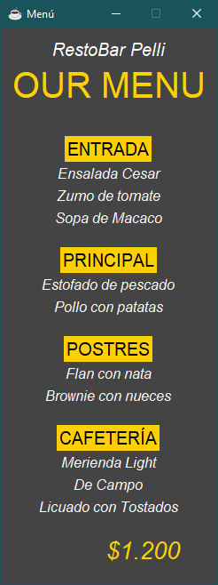

# Carta - Resto Bar
El programa facilita la creacion de una carta de resto-bar. 
- Por un lado se tiene el administrador para crear, borrar y modificar los platos del menú desde la terminal. 
- Por otra parte, se cuenta con una interface grafica sencilla pero moderna de los platos disponibles
- Los datos son almacenados en una base de datos sqlite3

### Requirements:
Los modulos utilizados son propios de __python 3.9.7__
